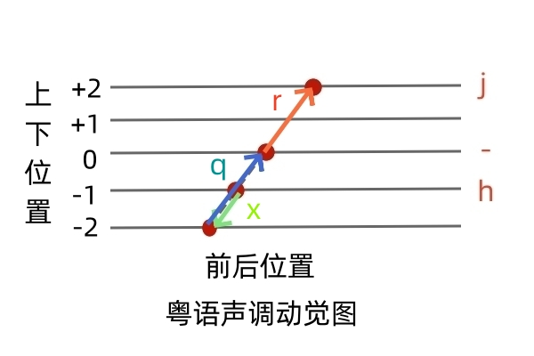

  

粵語聲調嘅動覺模型

  
  

1. 核心動覺模型：三級高度控制

模型將舌頭的活動簡化為一個「小球」在三個主要位置的運動，這直接決定了平調（定調）的高低。

以元音“aa”爲例。
  

高位（j 調）：舌葉提高靠近硬腭，舌體表面感覺緊張，將聲帶拉緊，發出最高音的 aaj 。

  
  
  

中位（基本調/3 聲）：舌頭處於放鬆的狀態，不刻意向上或向下，發出作為原點的 aa 。

  
  
  

低位（h 調）：舌葉降至最低，底部可能碰到牙床，聲帶隨之放鬆，發出低音的 aah 。

  
  

2. 進階控制：舌體形狀與壓縮（x 調）

當舌頭降到低位被牙齒擋住無法再下移時，會透過壓縮肌肉、使舌體變薄的方式進一步放鬆聲帶，發出更低的 aax 。

  
  
  

3. 動態升調的運動軌跡

升調則被視為舌葉在發音過程中由下往上的「滑動」過程：

  
  

q 調（中升）：小球從低位的「舌下區」往上升至中間放鬆位置，跨越兩格距離，發出 aaq 。

  
  

r 調（高升）：小球從中間放鬆位置繼續往上升至靠近硬腭的高位，發出 aar 。

  

4. 運動軸線與生理特徵

  

傾斜的軸線：舌頭的運動軌跡並非垂直，而是「往前方上伸」以拉緊聲帶，或「往後下方收縮」以放鬆聲帶 。

  

自動化調節：模型強調只要掌握這條軸線上的移動規律，發音時肌肉不疲累，就能自然流利地發出粵語六個聲調 。
